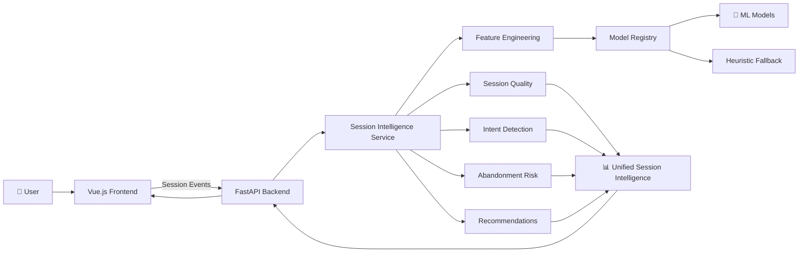
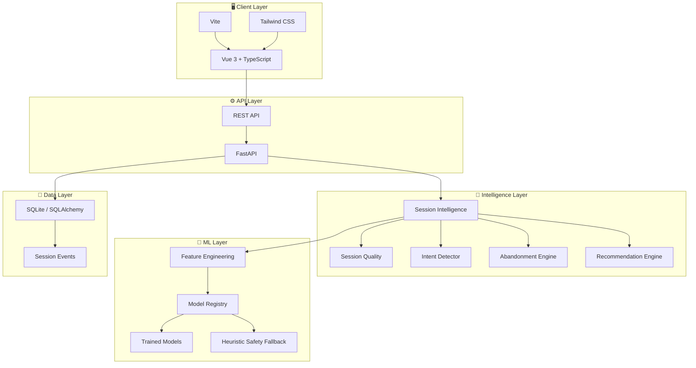
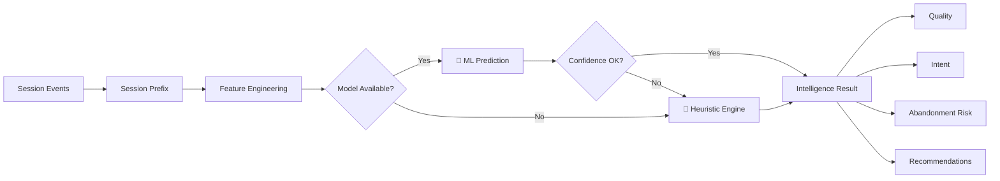
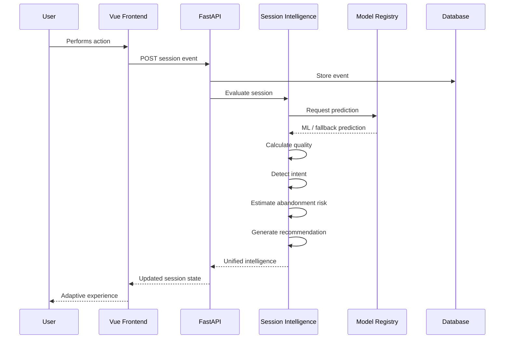
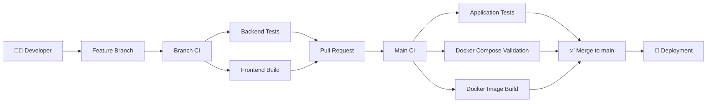
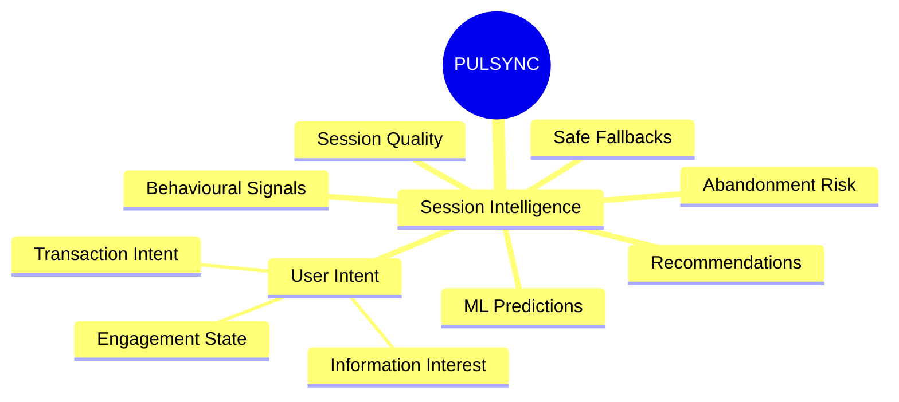

# ⚡ PULSYNC

> **FEG Hackathon 2026 — Challenge 01** 
>
> ### Session Quality & Session-to-Action Conversion

PULSYNC is an intelligent session-analysis platform designed to understand user behaviour in real time, estimate session quality, detect intent, predict abandonment risk, and surface actionable interventions.

Instead of treating every session the same, PULSYNC builds a continuously updated picture of **what the user is doing, what they are likely trying to achieve, and what should happen next.**

---

## 🎯 The Problem

Traditional session analytics mostly answer:

> **"What did the user do?"**

PULSYNC aims to answer:

> **"What is the user trying to do, how healthy is the session, and what action can improve the outcome?"**

The system analyses chronological session events and combines:

- 🧠 Machine Learning predictions
- 📊 Session-quality scoring
- 🎯 Intent detection
- ⚠️ Abandonment-risk estimation
- 🔄 Real-time session intelligence
- 💡 Actionable recommendations
- 🛡️ Responsible-gambling constraints and safe fallbacks

---

## 💡 Solution Overview



---

# 🏗️ Architecture

PULSYNC follows a modular architecture where the frontend, API, intelligence layer, ML pipeline, and persistence layer remain independently maintainable.



---

# 🧠 Hybrid Intelligence Engine

PULSYNC uses a **hybrid intelligence approach**.



### Why hybrid?

The ML layer provides data-driven predictions while deterministic heuristics provide a reliable fallback.

This gives PULSYNC:

- **ML-powered predictions** when models are available
- **Explainable behavioural signals**
- **Graceful degradation** when models are unavailable
- **Safer and deterministic constraints**
- **Real-time inference without blocking the session**

---

# 🤖 Machine Learning Pipeline

The ML system uses a **session-prefix strategy** so that predictions only use information that would actually have been available at that moment.

```mermaid
flowchart LR
    RAW["Historical Sessions"] --> CHUNK["Session Prefix Chunking"]
    CHUNK --> FE["Feature Engineering"]
    FE --> SPLIT["Temporal Data Split"]
    SPLIT --> TRAIN["Model Training"]
    TRAIN --> ART["Model Artifacts"]
    ART --> REG["Model Registry"]
    REG --> INF["Live Inference"]
    INF --> INTEL["Session Intelligence"]
```



### Core ML components

| Component | Responsibility |
|---|---|
| `feature_engineering.py` | Extracts chronological session features |
| `train_models.py` | Handles temporal splitting and model training |
| `model_registry.py` | Loads models and performs live inference |
| `artifacts/` | Stores trained models and metadata |

Example session-prefix features include:

- Events observed so far
- Unique sports interacted with
- Session depth
- Behavioural progression
- Interaction patterns
- Other derived session signals

---

# 🔄 Real-Time Session Flow

Every incoming event can update the current understanding of the session.



---

# 📁 Repository Structure

```text
feg-hackathon-2026-PULSYNC/
│
├── .github/
│   └── workflows/
│       ├── branch-ci.yml       # CI for feature/development branches
│       └── ci.yml              # Main / PR validation + Docker build
│
├── backend/
│   ├── app/
│   │   └── main.py             # FastAPI application
│   ├── ml/
│   │   ├── feature_engineering.py
│   │   ├── train_models.py
│   │   ├── model_registry.py
│   │   └── artifacts/
│   ├── services/
│   │   ├── session_intelligence.py
│   │   ├── session_quality.py
│   │   ├── intent_detector.py
│   │   ├── abandonment_engine.py
│   │   └── recommendation_engine.py
│   ├── tests/
│   ├── Dockerfile
│   ├── .dockerignore
│   └── requirements.txt
│
├── demo/
│   ├── src/
│   │   ├── components/
│   │   ├── views/
│   │   ├── services/
│   │   └── ...
│   ├── public/
│   ├── Dockerfile
│   ├── nginx.conf
│   ├── package.json
│   ├── vite.config.*
│   └── ...
│
├── docs/
│   ├── architecture.md
│   ├── impact-case.md
│   ├── compliance-note.md
│   └── dependencies.md
│
├── assets/
├── config/
├── docker-compose.yml
├── .env.example
├── LICENSE
├── README.md
└── .gitignore
```

---

# 🛠️ Technology Stack

| Layer | Technology |
|---|---|
| Frontend | Vue 3 |
| Language | TypeScript |
| Build Tool | Vite |
| Styling | Tailwind CSS |
| Backend | FastAPI |
| Backend Language | Python |
| ORM | SQLAlchemy |
| Database | SQLite |
| ML | Python / scikit-learn ecosystem |
| Model Artifacts | Joblib |
| Containerization | Docker |
| Orchestration | Docker Compose |
| CI/CD | GitHub Actions |
| Frontend Deployment | Vercel |
| Backend Deployment | Render |

---

# 🐳 Run the Complete Application Locally

The easiest way to run PULSYNC is with Docker Compose.

### Prerequisites

- Docker Desktop
- Git

### Start

```powershell
git clone https://github.com/Sai-Harshith-01/feg-hackathon-2026-PULSYNC.git
cd feg-hackathon-2026-PULSYNC
docker compose up --build
```

The services will be available at:

| Service | URL |
|---|---|
| 🌐 Frontend | http://localhost:8080 |
| ⚙️ Backend API | http://localhost:8000 |
| 📚 API Documentation | http://localhost:8000/docs |
| ❤️ Health Check | http://localhost:8000/api/health |

Stop the application:

```powershell
docker compose down
```

---

# 💻 Local Development Without Docker

## Frontend

```powershell
cd demo
npm install
npm run dev
```

Configure the backend URL when required:

```env
VITE_API_URL=http://localhost:8000
```

## Backend

From the repository root:

```powershell
pip install -r backend/requirements.txt
uvicorn backend.app.main:app --reload --port 8000
```

---

# 🧪 Testing

Backend tests:

```powershell
python -m pytest backend/tests -v
```

Frontend production build:

```powershell
cd demo
npm install
npm run build
```

Docker Compose validation:

```powershell
docker compose config
```

Docker image build:

```powershell
docker compose build
```

---

# 🚀 CI/CD Pipeline

PULSYNC uses GitHub Actions to prevent broken application code from reaching the main branch.



### Branch CI

Every non-main branch validates:

- Backend tests
- Frontend production build

### Main / Pull Request CI

The main pipeline additionally validates:

- Backend tests
- Frontend build
- Docker Compose configuration
- Docker image builds

Docker integration is therefore validated at the integration boundary rather than forcing every developer to maintain Docker configuration on feature branches.

---

# 🌐 Deployment

PULSYNC is deployed as separate frontend and backend services.

## 🚀 Live Demo

| Service | URL |
|---|---|
| 🌐 **PULSYNC Frontend** | https://feg-hackathon-2026-pulsync-fmn6yx0s6-sais-projects-55ce9fa9.vercel.app/ |
| ⚙️ **PULSYNC Backend API** | https://feg-hackathon-2026-pulsync.onrender.com/ |

### Frontend — Vercel

The Vue/Vite frontend is deployed independently through Vercel.

```text
GitHub
   │
   ▼
demo/
   │
   ▼
Vite Production Build
   │
   ▼
Vercel
   │
   ▼
🌐 Live PULSYNC UI
```

**Live frontend:**  
https://feg-hackathon-2026-pulsync-fmn6yx0s6-sais-projects-55ce9fa9.vercel.app/

### Backend — Render

The FastAPI backend is containerized using Docker and deployed as a web service on Render.

```text
GitHub
   │
   ▼
backend/Dockerfile
   │
   ▼
Docker Image
   │
   ▼
Render
   │
   ▼
FastAPI API
```

**Live backend:**  
https://feg-hackathon-2026-pulsync.onrender.com/

Useful backend endpoints:

- `/docs` — Interactive FastAPI / Swagger API documentation
- `/api/health` — Backend health check

> SQLite is suitable for the hackathon/demo environment, but production deployments requiring durable persistence should use a managed database.

---

# 📊 Core Intelligence Outputs

PULSYNC continuously evaluates several dimensions of a session:



### Session Quality

Estimates the health and quality of the current session based on observed behaviour.

### Intent Detection

Identifies what the user appears to be trying to accomplish.

### Abandonment Risk

Estimates the likelihood that a user will abandon the session.

### Recommendations

Converts session intelligence into actionable next-step recommendations.

---

# 🛡️ Responsible & Explainable Intelligence

PULSYNC is designed around a combination of intelligence and deterministic constraints.

Key principles:

- Explainable behavioural signals
- ML predictions with fallback behaviour
- Confidence-aware inference
- Deterministic safety constraints
- No dependence on ML availability for basic functionality
- Session-level rather than blindly user-level decisions

---

# 📚 Documentation

| Document | Description |
|---|---|
| [Architecture](docs/architecture.md) | System architecture and technical design |
| [Impact Case](docs/impact-case.md) | Expected business and user impact |
| [Compliance Note](docs/compliance-note.md) | Responsible and compliance considerations |
| [Dependencies](docs/dependencies.md) | Project dependencies and external components |

---

# 🎥 Demo

The application demonstrates the complete PULSYNC flow:

```text
User Interaction
       ↓
Session Event
       ↓
Real-Time Intelligence
       ↓
Quality + Intent + Risk
       ↓
Recommendation
       ↓
Adaptive User Experience
```

---

# ⚠️ Current Scope

This repository represents the **FEG Hackathon 2026 Challenge 01 implementation**.

Production-grade concerns such as large-scale distributed storage, authentication infrastructure, advanced model monitoring, and production observability would require additional infrastructure beyond the hackathon scope.

---

# 👥 Team

Built for **FEG Hackathon 2026 — Challenge 01**.

**PULSYNC — Turning session behaviour into actionable intelligence.**

---

<p align="center">

### ⚡ Observe. Understand. Act.

**PULSYNC**

</p>
